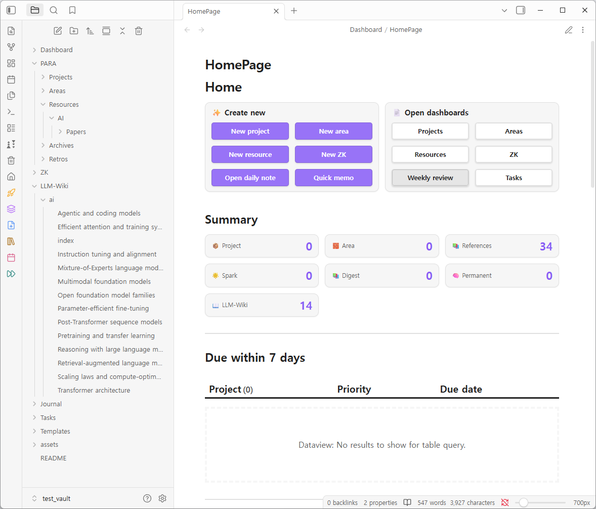
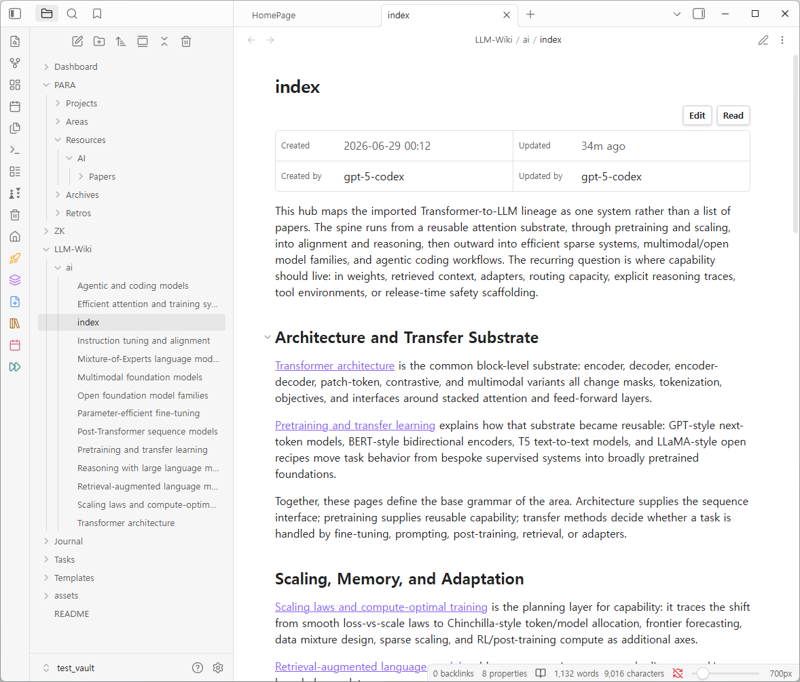

# 📚 PARA-ZK (with LLM-Wiki)

[](https://github.com/sponsors/kangig94)
[](https://buymeacoffee.com/kangig94)



> An LLM-maintained PARA + Zettelkasten knowledge wiki for Obsidian.

You curate the sources and ask the questions; PARA-ZK's workflows ingest them into
interlinked notes and keep frontmatter, references, and backlinks coherent, so
knowledge compounds in the vault instead of being re-derived on each query.

PARA-ZK runs as an Obsidian plugin (GUI commands + ribbon shortcuts) and, while
Obsidian is running, exposes the full workflow contract through a native CLI.
Its thin MCP server discovers that CLI contract and exposes shell-safe edit
tools (`replace`/`set`/`add`) so scripts and LLMs can drive the vault.

### **Curious what the output looks like?**



Browse a generated LLM-Wiki example (AI papers → interlinked concept pages):  
<https://kangig94.github.io/obsidian-para-zk/examples/llm-wiki/index>

## Install

**Requires:** Obsidian 1.12.3+

### Obsidian plugin

Install **PARA-ZK** from Obsidian's community plugin browser: Settings → Community
plugins → Browse, search **PARA-ZK**, then install and enable it.

Then scaffold the vault with the **PARA-ZK: Set up PARA-ZK vault** command (or
`para-zk:setup`). Setup is idempotent: it creates the PARA/ZK layout, templates,
and dashboards, overwrites plugin-owned scaffolding when generated content differs,
and offers to install the required community plugins (`deps=required`) or optional
UX enhancements (`deps=enhancements`).

### Claude Code / Codex (MCP)

With Obsidian running and `optsidian` or `obsidian` on `PATH`:

```text
# Claude Code
/plugin marketplace add kangig94/obsidian-para-zk
/plugin install para-zk@obsidian-para-zk

# Codex
codex plugin marketplace add kangig94/obsidian-para-zk
codex /plugins   # install "para-zk"
```

See [docs/MCP.md](docs/MCP.md) for details and generic MCP-client registration.

## Usage

- **GUI** — command palette (`PARA-ZK: …`) and left-ribbon shortcuts for project,
  area, resource, ZK, daily note, and quick memo.
- **CLI** — run `para-zk:describe` for the live list of surface types; add
  `type=<surface>` to drill into that surface's read/write keys. Full contract in
  [docs/CLI.md](docs/CLI.md).
- **MCP** — `describe` for the CLI contract plus shell-safe edit tools
  (`replace`/`set`/`add`); see [docs/MCP.md](docs/MCP.md).

CLI and MCP values are locale-neutral codes (e.g. `status=in_progress`); the
plugin renders localized labels in the note. Default locale is English — pass
`locale=ko` for a Korean vault.

## Skills (Claude Code / Codex)

Once the plugin is installed (above), these PARA-ZK skills are available as slash commands; Codex exposes the same set.

| Skill | Description |
| --- | --- |
| `import-resource` | Import a file, URL, web research, or synthesis into the vault as a resource note |
| `wiki-ingest` | Ingest canonical sources into the LLM-Wiki (`init` / `delta` / `per-import` / `re-ingest`) |
| `wiki-capture` | File a durable synthesis from a wiki conversation back as a new or updated wiki page (writes only on confirmation) |
| `wiki-lint` | Lint or health-check the LLM-Wiki on demand |
| `codex-setup` | Install or refresh PARA-ZK's Codex custom agents (e.g. `wiki-weaver`) |
